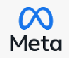

Hey Hey, Moi c'est Ahmed. Pour être plus complet  Ahmed Ogbinto.👋

Je commence par vous poser d'abord une petite question: Comment vous identifiez-vous dans l'univers du code

- Recruteurs:  Qui recherchez-vous?

- Professionels: Qui êtes-vous? Développeur Web - Développeur logiciel full Stack - Développeur Systèmes embarqués - Codeur

On n'a fait de vite s'embrouiller dans cet univers de technologies qui ne cessent d'évoluer. Aussi bien les recruteurs que les pro.

Moi, je me défini comme:                        

                                                    DÉVELOPPEUR WEB
                                              

- 🔭  Je travaille actuellement avec des technologies HTML - CSS - JAVASCRIPT - JQUERY - AJAX - PHP - SQL - MySQL - WORDPRESS

J'ai une passion spécial pour le langage JAVASCRIPT; ses frameworks FRONTEND: ANGULAR JS - REACT JS - VUS JS, BACKEND: NODE JS et son framework EXPRESS 
                                      
                                                                     
                                                                     
- 🌱 Actuellemnent j'ai un regard attentif sur les frameworks fullstack MEAN et METEOR

- 👯 J'aimerais collaborer sur des projets professionnels

- 🤔 Je continue toujours d'apprendre à

- 💬 Interroge moi sur la patience et la persévérance et je te répondrai que c'est le code informatique 😄

- 📫 MAIL ME: ahmedogbinto@gmail.com

- 😄 ~BouBou~ pseudonyme. J'apprécie

- ⚡ Je vous raconterai l'anecdote sur mon pseudonyme plus tard.

# gh-light-mode-only
# gh-dark-mode-only

### CONNECT WITH ME

### Langage and Tools

[]
    

